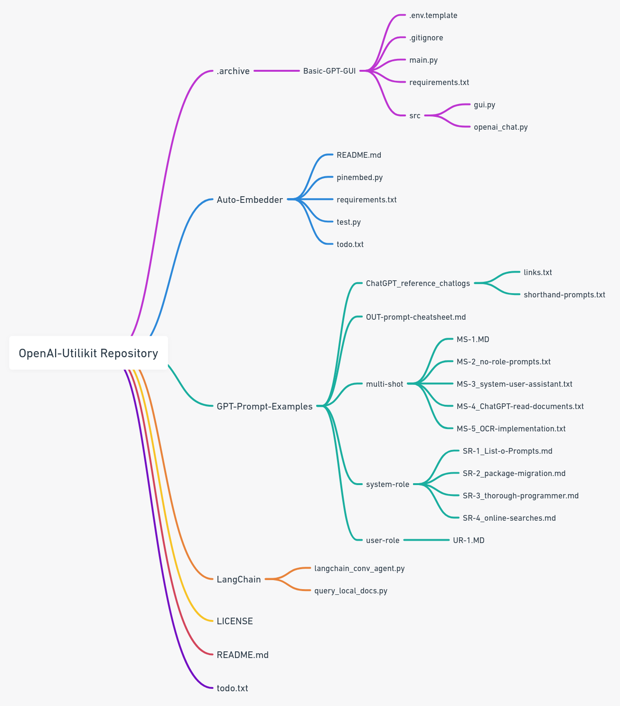

# OpenAI Utility Toolkit (OUT)

## Contents

#### 1. **[Auto-Embedder](./Auto-Embedder)**

Provides an automated pipeline for retrieving embeddings from [OpenAI's `text-embedding-ada-002`](https://platform.openai.com/docs/guides/embeddings) and upserting them to a [Pinecone index](https://docs.pinecone.io/docs/indexes).

   - **[pinembed.py](./Auto-Embedder/pinembed.py)**: A Python module to easily automate the retrieval of embeddings from OpenAI and storage in Pinecone.
   - **[.env.template](./Auto-Embedder/.env.template)**: Template for environment variables.

---

#### 2. **[GPT-Prompt-Examples](./GPT-Prompt-Examples)**

There are three main prompt types, [multi-shot](GPT-Prompt-Examples/multi-shot), [system-role](GPT-Prompt-Examples/system-role), [user-role](GPT-Prompt-Examples/user-role).

Please also see the [OUT-prompt-cheatsheet](GPT-Prompt-Examples/OUT-prompt-cheatsheet.md).

   - **[Cheatsheet for quick power-prompts](./GPT-Prompt-Examples/OUT-prompt-cheatsheet.md)**: A cheatsheet for GPT prompts.
   - **[multi-shot](./GPT-Prompt-Examples/multi-shot)**: Various markdown and text files for multi-shot prompts.
   - **[system-role](./GPT-Prompt-Examples/system-role)**: Various markdown files for system-role prompts.
   - **[user-role](./GPT-Prompt-Examples/user-role)**: Markdown files for user-role prompts.
   - **[Reference Chatlogs with GPT4](./GPT-Prompt-Examples/ChatGPT_reference_chatlogs)**: Contains chat logs and shorthand prompts.
  
---

<!--

  

-->

---

[LICENSE](./LICENSE)